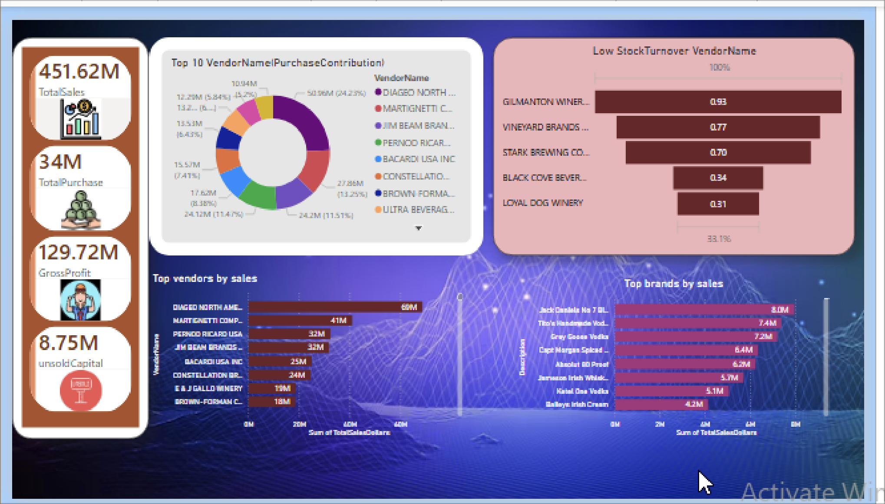

# Vendor Performance Dashboard

##  Project Overview
This project is a Power BI dashboard designed to analyze vendor performance. It provides insights into top vendors, low stock turnover, and overall sales and purchase performance using interactive visualizations.

---

## Dashboard Preview

---

##  Features
- Top 10 Vendors by Purchase Contribution  
- Top Vendors by Sales  
- Low Stock Turnover Analysis  
- Total Sales, Total Purchase, Gross Profit  
- Unsold Capital Tracking  
- Top Brands by Sales  

---

##  Dataset
- Source: CSV File  
- Contains vendor sales, purchase, and inventory data  

---

##  Installation & Usage
1. Download the project files  
2. Open Power BI Desktop  
3. Load the CSV dataset  
4. Open the `.pbix` file  
5. Refresh data and explore dashboard  

---

## Technologies Used
- Power BI  
- Python  
  - Pandas  
  - NumPy  
  - Matplotlib  
  - Seaborn  

---

## 📈 Key Insights
- Total Sales: 451.62M  
- Total Purchase: 34M  
- Gross Profit: 129.72M  
- Unsold Capital: 8.75M  
- Top vendors contribute major share in purchases  
- Low stock vendors help in inventory optimization  

---

##  Author
**Aman Kumar**  

🔗 LinkedIn: https://www.linkedin.com/in/aman-kumar-172342395/

---

## Support
If you like this project, give it a ⭐ on GitHub!
